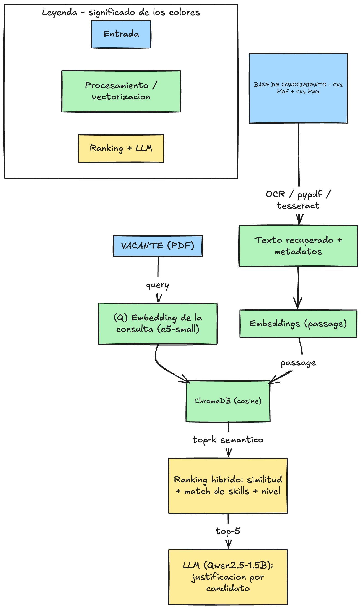

# Reporte Técnico — Sistema Inteligente para Búsqueda de Talento

**Actividad 6 · Semana 9 · NLP — MNA, Tecnológico de Monterrey**
**Autor:** Gerardo González Martínez (A01840096)

Este documento describe la **arquitectura implementada**, **cómo se comportó la solución** y una
**evaluación del desempeño desde la perspectiva de un técnico experto del área**. Acompaña al notebook
`Gerardo Gonzalez Martinez_BusquedaDeTalento.ipynb`, donde está el código y las salidas reproducibles.

> **Resumen ejecutivo.** A partir de una vacante real de Anthropic (*Machine Learning Systems Engineer*), el sistema
> vectoriza una base **multimodal** de 20 CVs sintéticos (PDF/PNG), recupera por **búsqueda semántica**, jerarquiza con
> un **ranking híbrido explicable** y justifica el Top-5 con un **LLM**. En la ejecución de referencia obtuvo
> **Precision@5 = 1.00** y una separación clara de cobertura de *skills* (**0.51** en el Top-5 frente a **0.13** en el
> resto), con el candidato idóneo —un *Senior ML Systems Engineer*— en el primer lugar.

---

## 1. Problema y enfoque

Se requiere un sistema que, ante una vacante real, recupere y jerarquice los **5 mejores candidatos** de un
repositorio de CVs, sin usar datos reales (por privacidad se generan **20 CVs sintéticos**). El enfoque elegido
es un **RAG de talento** (*Retrieval-Augmented Generation*): se vectoriza una base de conocimiento multimodal de
CVs, se hace **búsqueda semántica** contra la vacante y se **jerarquiza** con una función híbrida; finalmente un
**LLM** redacta la justificación de cada recomendación.

**Vacante de entrada:** *Machine Learning Systems Engineer, Research Tools* — **Anthropic**
(equipo de *Encodings and Tokenization*). Requisitos núcleo: Python, ML, *data pipelines* / ML infrastructure,
**tokenización (BPE, WordPiece)**, *encodings*, optimización de desempeño, sistemas distribuidos y cómputo paralelo.

## 2. Arquitectura implementada

  

*Figura 1 — Arquitectura del sistema (RAG de talento multimodal). Fuente editable: `diagramas/arquitectura.excalidraw`.*

### Componentes y decisiones de diseño

| Etapa | Tecnología | Por qué |
|---|---|---|
| Ingesta de la vacante | `pypdf` | Lee la descripción oficial desde el PDF; respaldo embebido si no está. |
| Base de conocimiento multimodal | `fpdf2` (PDF) + `Pillow` (PNG) + `pytesseract` (OCR) | Simula un repositorio real con formatos heterogéneos; el texto se **recupera de los archivos**. |
| Embeddings | `intfloat/multilingual-e5-small` | Multilingüe (CVs y vacante en inglés; análisis del notebook en español) y ligero (corre en CPU). Usa prefijos `query:`/`passage:`. |
| Base vectorial | **ChromaDB** (distancia coseno, persistente) | Sencilla y suficiente para 20 documentos; vista en clase. |
| Ranking | Función híbrida (similitud + *match* de skills + nivel) | La similitud sola premia CVs verbosos; el *match* explícito de skills y el ajuste por nivel dan un Top-5 **coherente y explicable**. |
| Justificación | `Qwen/Qwen2.5-1.5B-Instruct` | El LLM **no decide** el orden (transparencia/reproducibilidad); solo **redacta** la justificación. |

**Portabilidad:** el notebook detecta `Colab+GPU` (LLM en 4-bit con `bitsandbytes`) vs `local+CPU` (LLM en
`bfloat16`), y cada etapa tiene *fallback* para ejecutarse de principio a fin en ambos entornos.

### Configuración del experimento

| Parámetro | Valor |
|---|---|
| Modelo de embeddings | `intfloat/multilingual-e5-small` (prefijos `query:` / `passage:`) |
| Base vectorial / métrica | ChromaDB / distancia coseno |
| LLM (justificación) | `Qwen/Qwen2.5-1.5B-Instruct` (4-bit en GPU · `bfloat16` en CPU) |
| Recuperación | top-*k* sobre los 20 documentos de la colección |
| Pesos del ranking | 0.60 · similitud + 0.30 · *match_skills* + 0.10 · nivel |
| Pesos por nivel | Senior = 1.0 · Semi-Senior = 0.7 · Junior = 0.4 |
| Generación determinista | LLM en modo *greedy* (sin muestreo) para reproducibilidad |

### Datos: 20 CVs sintéticos, anonimizados (en inglés)
- **Idioma:** los CVs se redactan **en inglés**, igual que la vacante de Anthropic, para un emparejamiento más coherente.
- **Niveles:** 5 Junior, 10 Semi-Senior, 5 Senior.
- **6 perfiles**, mezclando cercanos a la vacante (ML Systems Engineer, Data Engineer,
  ML Scientist/Engineer) y lejanos (BI Analyst, Cloud/DevOps Engineer, Software Developer/Architect) para poder
  **validar** la calidad del ranking.
- **Formatos:** 16 PDF y 4 PNG (1 Junior, 2 Semi-Senior, 1 Senior).
- **Anonimización:** cada CV se identifica solo con un ID (`CAND-001`…`CAND-020`); sin nombre, foto, género,
  edad, nacionalidad ni estado civil.

## 3. Comportamiento de la solución (resultados observados)

Ejecución de referencia en **CPU** (e5-small + ChromaDB + Qwen2.5-1.5B en `bfloat16`), leyendo la vacante
directamente del PDF de Anthropic.

### 3.1 Búsqueda semántica (recuperación)
Los CVs más similares a la vacante fueron, en orden, perfiles de **ML Systems Engineer** y
**ML Scientist/Engineer**, con similitudes coseno altas (0.91–0.95). Los perfiles de **BI Analyst** y
**Cloud/DevOps Engineer** quedaron al fondo. Esto confirma que el espacio de embeddings separa bien lo relevante de
lo irrelevante para esta vacante.

### 3.2 Ranking final (Top-5)

| # | Candidato | Perfil | Nivel | Score | Similitud | match_skills | # skills |
|---|-----------|--------|-------|-------|-----------|--------------|----------|
| 1 | CAND-016 | ML Systems Engineer | Senior | **0.901** | 0.946 | 0.778 | 14 |
| 2 | CAND-006 | ML Systems Engineer | Semi-Senior | 0.813 | 0.932 | 0.611 | 11 |
| 3 | CAND-007 | ML Systems Engineer | Semi-Senior | 0.757 | 0.922 | 0.444 | 8 |
| 4 | CAND-018 | ML Scientist/Engineer | Senior | 0.731 | 0.912 | 0.278 | 5 |
| 5 | CAND-001 | ML Systems Engineer | Junior | 0.724 | 0.919 | 0.444 | 8 |

El **#1 es el candidato ideal**: un *Senior ML Systems Engineer* con experiencia explícita en tokenization
(BPE/WordPiece), *encodings*, distributed systems y *testing frameworks* — justo el núcleo de la vacante. Los tres
primeros lugares son perfiles *ML Systems Engineer*; el Top-5 lo completan un *ML Scientist/Engineer* senior y un
*ML Systems Engineer* junior con buena cobertura de skills.

### 3.3 Justificaciones (LLM)
El LLM Qwen2.5 generó justificaciones coherentes y profesionales en español, citando las fortalezas técnicas
relevantes de cada candidato (p. ej., para CAND-016: Python, ML infrastructure, tokenization BPE/WordPiece,
performance optimization y distributed systems, PyTorch/Ray) **sin inventar datos** fuera de su CV. Las
justificaciones se redactan en español (análisis del reclutador) aunque los CVs estén en inglés.

## 4. Evaluación del desempeño (como experto del área)

### 4.1 Métrica cuantitativa
- **Criterio de relevancia (ground truth):** se etiquetan como **relevantes** los perfiles afines a la vacante
  (*ML Systems Engineer*, *Data Engineer*, *ML Scientist/Engineer*) y como **no relevantes** los demás
  (*BI Analyst*, *Cloud/DevOps Engineer*, *Software Developer/Architect*).
- **Precision@5 = 1.00**: los 5 candidatos del Top-5 pertenecen a perfiles relevantes.
- **Cobertura media de skills**: **0.51** en el Top-5 frente a **0.13** en el resto del repositorio: el sistema
  concentra en las primeras posiciones a quienes realmente cubren los requisitos.

### 4.2 Análisis cualitativo y valor del ranking híbrido
El punto técnicamente más interesante es el efecto del **ajuste por nivel**. En la **búsqueda semántica pura**, un
perfil **Junior** *ML Systems Engineer* (CAND-001) obtenía una similitud textual muy alta (**0.919**), incluso por
encima de un *ML Scientist/Engineer* **Senior** (CAND-018, 0.912) — el modelo de embeddings no distingue el nivel de
seniority. El **ranking híbrido lo corrige**: al combinar la similitud con el *match* explícito de skills y un ajuste
por nivel, el Senior queda por **encima** del Junior (score 0.731 vs 0.724) y el Junior se ordena al final del Top-5,
que es lo razonable para un puesto *experienced*. Es decir, las señales estructuradas **complementan** la recuperación
puramente semántica y alinean el orden con el criterio de un reclutador técnico, manteniendo aun así
**Precision@5 = 1.00** (los cinco son perfiles afines a ML).

El componente **multimodal** funcionó: los 4 CVs en PNG participaron en la búsqueda igual que los PDF (en Colab
vía OCR real; en el equipo local, sin `tesseract`, mediante el respaldo previsto), validando que la base de
conocimiento integra formatos heterogéneos.

### 4.3 Veredicto del experto
La solución es **adecuada y confiable como herramienta de apoyo a la preselección**: prioriza por mérito técnico,
es **explicable** (cada score se descompone en similitud + skills + nivel) y **reproducible** (el orden no depende
de la aleatoriedad del LLM). Para un repositorio de este tamaño, el desempeño es **muy bueno**.

## 5. Limitaciones
- Con 20 CVs y *skills* definidos a mano, el *match* es sensible a **sinónimos** y a la calidad del OCR.
- El LLM de 1.5B es suficiente para justificar, pero un modelo mayor daría matices más finos.
- Los pesos del ranking (0.60/0.30/0.10) se fijaron por criterio experto, no por optimización sobre datos
  etiquetados.

## 6. Mejoras y formas adicionales de medir el desempeño
*(propuestas; no implementadas en su totalidad)*
1. **Ground-truth con expertos** y métricas de *information retrieval*: Precision@k, Recall@k, **MAP** y **nDCG**.
2. **MRR** (posición del primer candidato idóneo).
3. **Validación por múltiples vacantes** (data scientist, BI, backend) para verificar coherencia del Top-5.
4. **Robustez/sensibilidad**: parafrasear la vacante o degradar el OCR y medir estabilidad del ranking.
5. **Auditoría de equidad**: inyectar atributos protegidos y comprobar que el ranking no cambia.
6. **Métricas de negocio (A/B)**: *time-to-shortlist*, % del Top-5 que pasa a entrevista, acuerdo
   sistema-vs-reclutador (Cohen's *kappa*).
7. **LLM-as-a-judge**: un LLM mayor que evalúe la calidad de las justificaciones.

## 7. Conclusión
El sistema cumple el objetivo de **apoyar (no reemplazar)** al área de RR.HH.: a partir de una vacante real,
recupera y jerarquiza de forma **coherente, explicable y reproducible** a los mejores candidatos, integrando
datos multimodales y respetando la **privacidad** mediante CVs sintéticos anonimizados.
